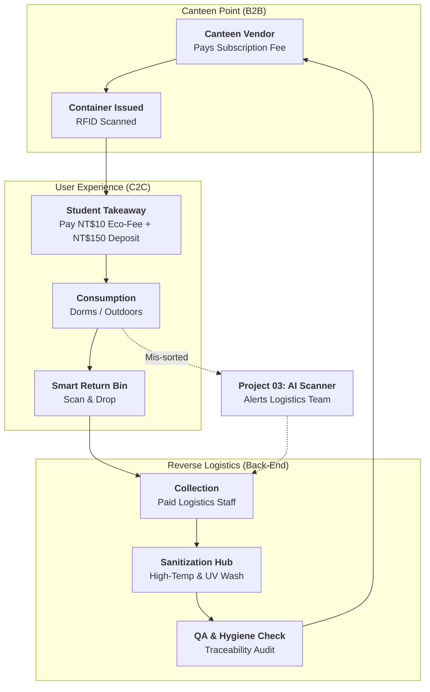
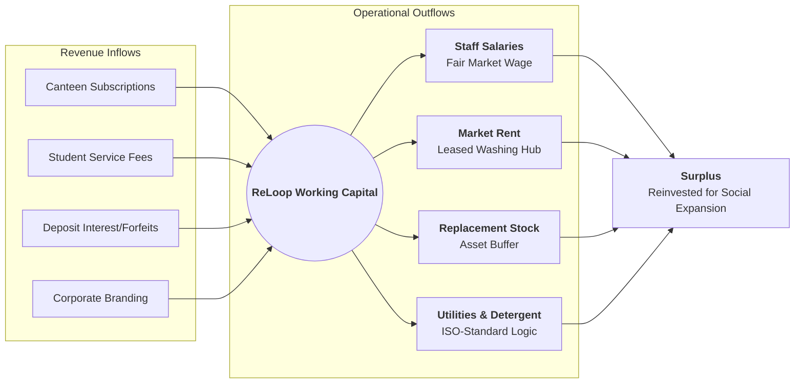

# 🔄 ReLoop: Operational & Financial Workflows

This document visualizes the "Self-Sustaining" circular model of ReLoop. All steps are designed with financial viability in mind, adhering to the principle that every operational component is fully funded and accounted for.

---

## 🏗️ 1. The Operational Cycle (Circular Hub)
This cycle shows the high-intensity movement of assets across the campus.

---

## 💰 2. Financial Value Flow (The "Paid" Model)
Every operation is backed by a specific revenue stream to ensure independence from subsidies.

---

## 🖼️ 3. Visual Infographic

---

## 🌍 Language Descriptions

### [EN] Workflow Explanation
The ReLoop workflow is a closed-loop system where every transition is tracked. Revenue from vendors and students covers the paid labor and market-rate rent. The integration with Project 03 (AI Scanner) ensures that lost assets are recovered, maintaining a high-integrity asset pool.

### [ID] Penjelasan Alur Kerja
Alur kerja ReLoop adalah sistem loop tertutup di mana setiap transisi dilacak. Pendapatan dari vendor dan mahasiswa mencakup upah tenaga kerja dan sewa pasar. Integrasi dengan Proyek 03 (Pemindai AI) memastikan bahwa aset yang hilang dipulihkan, menjaga ketersediaan aset yang berintegritas tinggi.

### [ZH] 工作流程說明
ReLoop 的工作流程是一個閉環系統，每一步移動皆受數位追蹤。來自商家與學生的收益足以支應支付給員工的薪資與市場化租金。透過與 Project 03 (AI 分類器) 的串接，遺失的餐具能被精準回收，維持資產池的高效率運轉。
