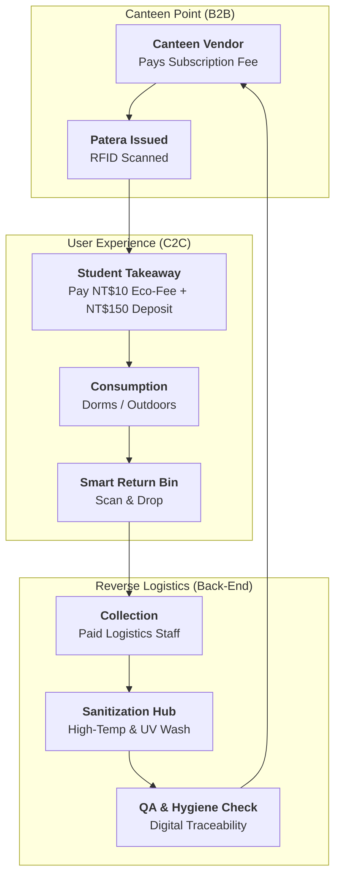
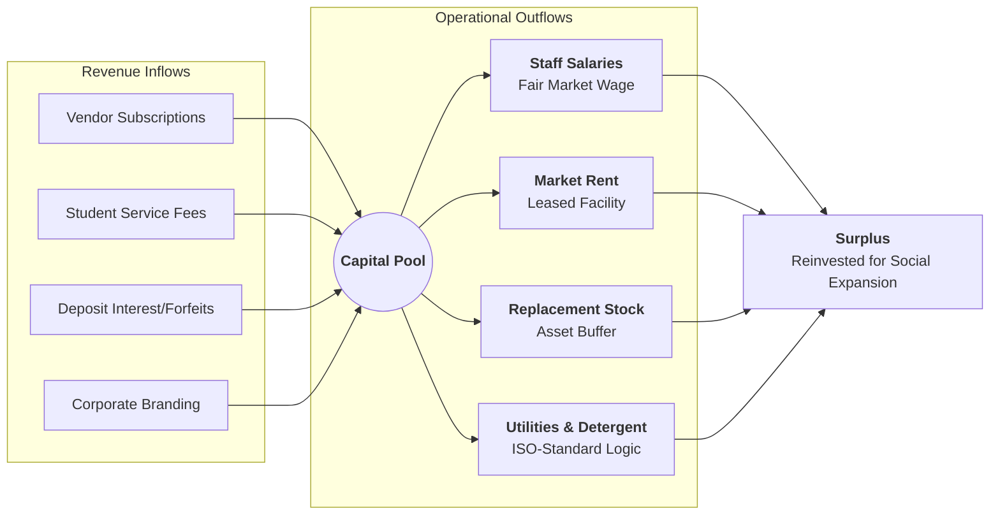

# 🔄 Novus Ordo Patera: Operational & Financial Workflows

This document visualizes the "Self-Sustaining" circular model of **Novus Ordo Patera**. All steps are designed with financial viability in mind, adhering to the principle that every operational component is fully funded and accounted for.

---

## 🏗️ 1. The Operational Cycle (Circular Hub)
This cycle shows the high-intensity movement of assets across the campus.

---

## 💰 2. Financial Value Flow (The "Paid" Model)
Every operation is backed by a specific revenue stream to ensure independence from subsidies.

---

## 🖼️ 3. Visual Infographic

---

## 🌍 Language Descriptions

### [EN] Workflow Explanation
The **Novus Ordo Patera** workflow is a closed-loop system where every transition is tracked. Revenue from vendors and students covers the paid labor and market-rate rent. Digital hygiene traceability allows users to verify the sanitization status of their dish in real-time.

### [ID] Penjelasan Alur Kerja
Alur kerja **Novus Ordo Patera** adalah sistem loop tertutup di mana setiap transisi dilacak. Pendapatan dari vendor dan mahasiswa mencakup upah tenaga kerja dan sewa pasar. Pelacakan higienitas digital memungkinkan pengguna untuk memverifikasi status sanitasi wadah mereka secara real-time.

### [ZH] 工作流程說明
**Novus Ordo Patera** 的工作流程是一個閉環系統，每一步移動皆受數位追蹤。來自商家與學生的收益足以支應支付給員工的薪資與市場化租金。數位衛生可追溯性讓用戶能即時驗證餐具的消毒檢查狀態。
