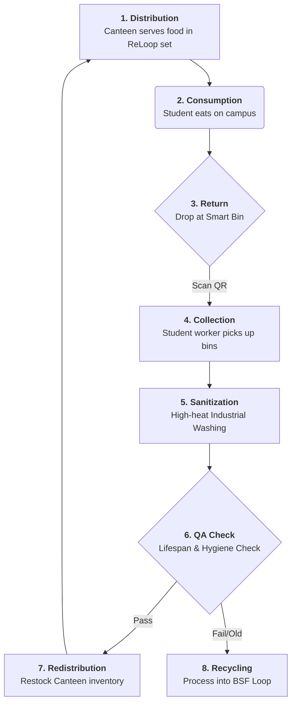

# 🔄 ReLoop Operational Workflow

This document outlines the end-to-end operational cycle of the ReLoop service at the NQU campus. The system is designed to be **Circular**, **Hygienic**, and **Data-Driven**.

---

## 🗺️ Visual Workflow (Cycle)

---

## 📋 Detailed Step-by-Step Process

### Phase 1: Distribution & User Interaction
1.  **Subscription**: Student joins via the LINE Bot/App and pays a NT$200 deposit.
2.  **Ordering**: Student orders at the NQU Canteen. The vendor prepares the meal in a ReLoop container.
3.  **Checkout**: Student scans the **Container QR Code** at the checkout counter. Their "Current Usage" is recorded in the database.

### Phase 2: Post-Consumption & Collection
4.  **Drop-off**: Student finds a **ReLoop Smart Bin** (located at dorms/common areas).
5.  **Return Scan**: Student scans the container again at the bin. The bin door opens, and the "Return" is logged. Their deposit is "unlocked" for the next meal.
6.  **Full-Bin Alert**: When the bin is 80% full, an automated alert is sent to the NQU Work-Study Telegram group.

### Phase 3: Logistics & Sterilization
7.  **Pickup**: A student worker uses an electric cart to swap the full bin with an empty sanitized bin.
8.  **Washing**: Containers are brought to the Centeral Washing Unit.
    *   **Pre-rinse**: Mechanical removal of food scraps.
    *   **High-Heat Wash**: 82°C (180°F) industrial cycle for sterilization.
9.  **Drying & UV**: Containers are dried and stored in **UV-C cabinets** to maintain sterility.

### Phase 4: Asset Management & Quality Control
10. **Lifespan Tracking**: During the washing cycle, the system automatically increments the "Total Uses" for each scanned QR code.
11. **Inspection**: Any container with visible scratches or reaching its 500th use is pulled from the cycle.
12. **Restocking**: Sanitized sets are delivered back to the canteen vendors in sealed, clean transportation boxes.

---

## 🛡️ Sterility Guardrails
*   **72-Hour Rule**: Any clean container not used within 72 hours is automatically sent back for a "Sanity Rinse."
*   **Batch Integrity**: Each batch is dated and tagged. The canteen uses **FIFO (First-In, First-Out)** methodology.

---
*Operational workflow optimized for National Quemoy University (NQU) based on the Huang et al. 2026 study.*
