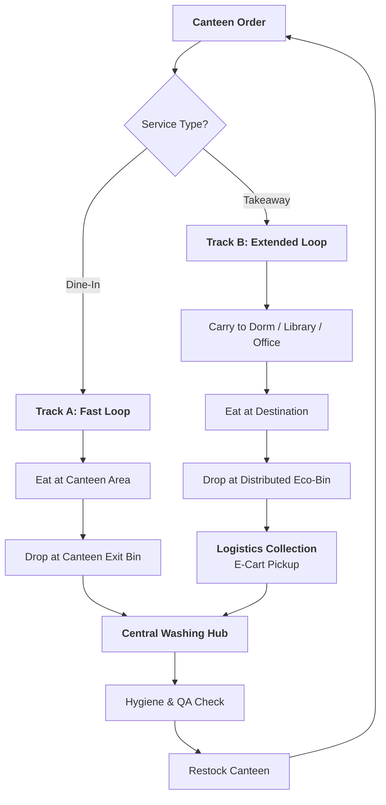

# 🔄 ReLoop Operational Workflow (Dine-In vs. Takeaway)

This document outlines the dual-track operational cycle of the ReLoop service at the NQU campus. The system handles both on-site eating and takeaway to maximize convenience and waste reduction.

---

## 🗺️ Visual Workflow (The Two Tracks)

---

## 📋 Operational Breakdown

### Track A: Dine-In (The Instant Return)
*   **Target**: Students/Staff eating at the canteen tables.
*   **Process**: 
    1.  Canteen serves food in the ReLoop tray (No lid).
    2.  User eats.
    3.  User drops dirty tray at the **"Instant Return Station"** located at the canteen tray return area.
*   **Advantage**: Minimal logistics; containers are back in the washing hub within minutes.

### Track B: Takeaway (The Distributed Loop)
*   **Target**: Students eating in dorms, offices, or study rooms.
*   **Process**:
    1.  Canteen serves food in the ReLoop tray + **Secure Lid**.
    2.  User scans QR at checkout to link the container to their account.
    3.  User eats at their convenience at a distant location.
    4.  User finds the **nearest campus bin** (Dorm gate, etc.) to drop the empty box.
*   **Advantage**: Replaces the need for 30,000+ single-use bento boxes annually per canteen.

---

## 📋 Step-by-Step Step Management

| Step | Action | Responsibility |
| :--- | :--- | :--- |
| **1. Order** | Scan user LINE ID & Container QR | Canteen Staff |
| **2. Return** | Drop in bin (Dine-in or Distributed) | User |
| **3. Logic** | Collect bins & swap for empty ones | ReLoop Student Team |
| **4. Sanitization**| High-heat wash (82°C) + UV-C drying | Washing Hub Staff |
| **5. Audit** | Log batch status & hygiene check | Manager |

---

## 🛡️ Takeaway Guardrails (The "3-Day" Rule)
To prevent containers from piling up in dorm rooms:
1.  **24-Hour Nudge**: LINE bot sends a friendly "Don't forget to return!" message.
2.  **48-Hour Alert**: Reminder that the "Deposit Hold" will be activated soon.
3.  **72-Hour Hold**: NT$150 deposit is temporarily held. This ensures users prioritize returning takeaway boxes during their next trip to class.

---

## 🛡️ Anti-Loss & Asset Recovery (Asset Protection)

To prevent the "Internal Leakage" of containers, the following mechanisms are active:

1.  **Financial Guardrail (72h Forfeit)**:
    *   Any container scan that is not "Closed" by an Eco-Bin return scan within 72 hours triggers a **NT$150 deposit forfeit**. This funds the purchase of a replacement unit.
2.  **Trash-Scanner "Rescue"**:
    *   Integration with **Project 03 (AI Trash Scanner)**. If a ReLoop box is thrown into general waste, the scanner flags the ID and alerts the logistics team for immediate recovery.
3.  **Community "Rescue" Rewards**:
    *   Students who find and return "Stranded" containers (left on tables or in regular bins) receive **2 NTD Eco-Karma credit** via LINE Pay.
4.  **Membership Suspension**:
    *   Chronic "Loss-making" users are temporarily suspended from the system to maintain the high-integrity circular loop.

---
*Operational workflow optimized for National Quemoy University (NQU) - Phase 0 & 1.*
