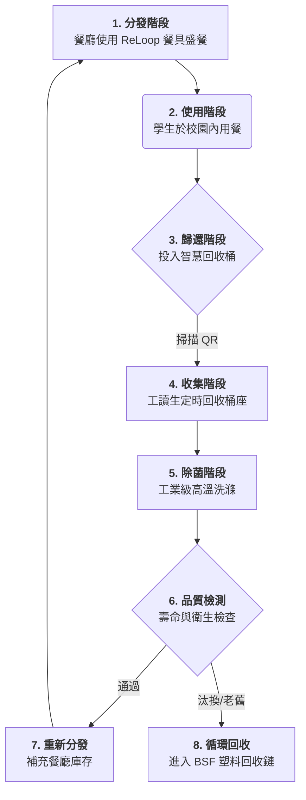

# 🔄 ReLoop 營運流程規範

本文件詳細說明 ReLoop 服務在金門大學 (NQU) 校園的端到端營運週期。本系統設計核心為**循環化**、**衛生化**與**數據驅動**。

---

## 🗺️ 視覺化流程圖 (循環週期)

---

## 📋 詳細步驟說明

### 第一階段：分發與使用者互動
1.  **訂閱註冊**: 學生透過 LINE 官方帳號加入，並支付 NT$200 押金。
2.  **訂餐**: 學生在餐廳訂餐，店家使用 ReLoop 循環餐盒盛裝。
3.  **結帳紀錄**: 學生在櫃檯掃描**餐盒 QR Code**，系統記錄該餐具目前由該學生使用。

### 第二階段：餐後歸還與收集
4.  **投放**: 學生在宿舍或教學大樓找到 **ReLoop 智慧回收桶**。
5.  **歸還掃描**: 學生在回收桶再次掃描餐盒，桶門開啟後投入。系統記錄歸還，並「解鎖」學生的押金額度。
6.  **滿桶預警**: 當回收桶量達到 80% 時，系統會自動發送通知至工讀生維運群組。

### 第三階段：物流與除菌處理
7.  **收集**: 維運人員使用電動裝卸車將滿桶運回，並換上乾淨的空桶。
8.  **洗滌**: 餐具進入中央洗滌站。
    *   **預洗**: 機械式移除食物殘渣。
    *   **高溫洗滌**: 使用 82°C (180°F) 工業循環進行完整除菌。
9.  **乾燥與封存**: 餐具乾燥後存放在 **UV-C 紫外線殺菌櫃**中，保持除菌狀態。

### 第四階段：資產管理與品管
10. **壽命追蹤**: 在洗滌掃描過程中，系統自動累加每個 QR Code 的「循環次數」。
11. **巡檢**: 任何有顯著刮痕或達到 **500 次**循環的餐盒將被移出系統。
12. **補貨**: 經過除菌封存的餐具以密封儲存箱運回餐廳，供店家循環使用。

---

## 🛡️ 衛生安全護欄
*   **72 小時原則**: 任何超過 72 小時未使用的乾淨餐具，必須重新進行「除菌沖洗」。
*   **批次管理**: 每個批次均有日期標籤。餐廳嚴格執行 **FIFO (先進先出)** 管理。

---
*本營運流程針對金門大學 (NQU) 環境優化，參考 Huang et al. 2026 研究成果。*
