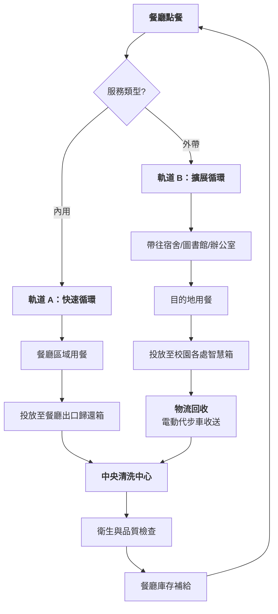

# 🔄 ReLoop 營運流程 (內用 vs. 外帶)

本文件概述了金大 (NQU) 校園內 ReLoop 服務的雙軌營運週期。該系統同時處理校內用餐與外帶需求，以極大化便利性與減廢成效。

---

## 🗺️ 視覺化流程 (雙軌並行)

---

## 📋 營運細節拆解

### 軌道 A：內用 (即時歸還)
*   **目標對象**：在餐廳座位區用餐的師生。
*   **流程**： 
    1.  餐廳使用 ReLoop 餐盤 (不含蓋) 出餐。
    2.  使用者用餐完畢。
    3.  使用者將髒餐具投放至餐廳出口處的 **「即時歸還站」**。
*   **優勢**：物流需求極低，餐具能在幾分鐘內回到清洗中心。

### 軌道 B：外帶 (分散式循環)
*   **目標對象**：在宿舍、辦公室或研討室用餐的師生。
*   **流程**：
    1.  餐廳使用 ReLoop 餐盤 + **密封防漏蓋** 出餐。
    2.  使用者結帳時掃描 QR Code 連動帳號。
    3.  使用者在校園其他地點用餐。
    4.  使用者就近尋找 **校園歸還點** (如宿舍門口) 投放空餐盒。
*   **優勢**：可取代單一餐廳每年產生的上萬個一次性便當盒。

---

## 📋 營運步驟管理

| 步驟 | 行動 | 責任方 |
| :--- | :--- | :--- |
| **1. 點餐** | 掃描使用者 LINE ID 與餐具 QR | 餐廳員工 |
| **2. 歸還** | 投放至歸還箱 (內用或分散式) | 使用者 |
| **3. 物流** | 定時巡迴回收與補給空白箱體 | ReLoop 學生團隊 |
| **4. 殺菌** | 高溫洗淨 (82°C) + UV-C 乾燥 | 清洗中心人員 |
| **5. 稽核** | 紀錄批次狀態與衛生抽檢 | 經理 |

---

## 🛡️ 外帶防護機制 (「3 天」原則)
為防止餐盒在宿舍房間堆積：
1.  **24 小時提醒**：LINE 機器人發送溫馨提醒。
2.  **48 小時警示**：通知即將啟動「押金扣留」程序。
3.  **72 小時扣留**：暫時扣留 NT$150 押金。這將促使使用者在下次出門上課時順手歸還餐盒。

---

## 🛡️ 防遺失與資產回收機制 (資產保護)

為防止餐具資產「內部流失」，系統設有以下機制：

1.  **財務護欄 (72 小時扣罰)**：
    *   任何在 72 小時內未被智慧箱歸還掃描「結案」的紀錄，將觸發 **150 元押金沒收**。此資金將用於購入新的替換餐具。
2.  **垃圾掃描器「救援」**：
    *   與 **[03 智慧垃圾掃描器]** 項目連動。若 ReLoop 餐盒被丟入一般垃圾桶，掃描器將標記該 ID 並通知物流團隊前往救援回收。
3.  **社區「救援」獎勵**：
    *   學生若發現並歸還「流浪」餐盒（如被遺留在桌上或一般垃圾桶內），將獲得 **2 元減碳獎勵金** (透過 LINE Pay)。
4.  **會員停權機制**：
    *   頻繁遺失餐具且不配合歸還的使用者將被暫時停權，以維持循環圈的資產完整性。

---
*營運流程優化：國立金門大學 (NQU) - 階段 0 與 階段 1。*
