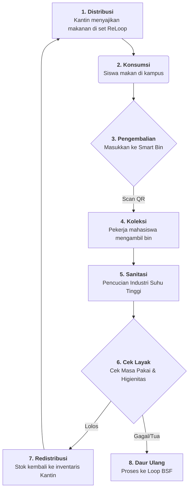

# 🔄 Alur Operasional ReLoop

Dokumen ini merinci siklus operasional end-to-end dari layanan ReLoop di kampus NQU. Sistem ini dirancang untuk menjadi **Sirkular**, **Higienis**, dan **Berbasis Data**.

---

## 🗺️ Alur Visual (Siklus)

---

## 📋 Detail Proses Langkah-demi-Langkah

### Fase 1: Distribusi & Interaksi Pengguna
1.  **Subskripsi**: Siswa bergabung melalui LINE Bot/App dan membayar deposit NT$200.
2.  **Pemesanan**: Siswa memesan di Kantin NQU. Vendor menyiapkan makanan dalam wadah ReLoop.
3.  **Checkout**: Siswa memindai **Kode QR Wadah** di konter pembayaran. Penggunaan mereka dicatat dalam database.

### Fase 2: Pasca-Konsumsi & Pengumpulan
4.  **Drop-off**: Siswa menemukan **Smart Bin ReLoop** (berlokasi di asrama/area umum).
5.  **Scan Kembali**: Siswa memindai wadah lagi di bin. Pintu bin terbuka, dan pengembalian dicatat. Deposit mereka "terbuka" untuk makanan berikutnya.
6.  **Peringatan Bin Penuh**: Ketika bin terisi 80%, peringatan otomatis dikirim ke grup Telegram mahasiswa kerja-paruh waktu.

### Fase 3: Logistik & Sterilisasi
7.  **Penjemputan**: Pekerja mahasiswa menggunakan cart elektrik untuk menukar bin penuh dengan bin kosong yang sudah disanitasi.
8.  **Pencucian**: Wadah dibawa ke Unit Pencucian Pusat.
    *   **Bilas Awal**: Pembersihan sisa makanan secara mekanis.
    *   **Cuci Suhu Tinggi**: Siklus industri 82°C (180°F) untuk sterilisasi.
9.  **Pengeringan & UV**: Wadah dikeringkan dan disimpan dalam **lemari UV-C** untuk menjaga sterilitas.

### Fase 4: Manajemen Aset & Pengendalian Mutu
10. **Pelacakan Masa Pakai**: Selama siklus pencucian, sistem secara otomatis menambah "Total Pemakaian" untuk setiap kode QR yang dipindai.
11. **Inspeksi**: Wadah apa pun dengan goresan terlihat atau mencapai pemakaian ke-500 ditarik dari siklus.
12. **Stok Ulang**: Set yang telah disanitasi dikirim kembali ke vendor kantin dalam kotak transportasi bersih yang tersegel.

---

## 🛡️ Batasan Sterilitas
*   **Aturan 72 Jam**: Wadah bersih yang tidak digunakan dalam 72 jam otomatis dikirim kembali untuk "Bilas Sanitasi."
*   **Integritas Batch**: Setiap batch diberi tanggal dan tag. Kantin menggunakan metodologi **FIFO (First-In, First-Out)**.

---
*Alur operasional dioptimalkan untuk Universitas Nasional Quemoy (NQU) berdasarkan studi Huang et al. 2026.*
