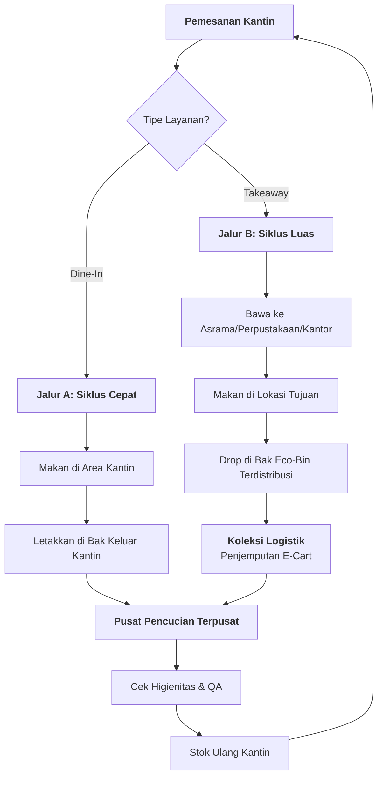

# 🔄 Alur Kerja Operasional ReLoop (Makan di Tempat vs. Dibungkus)

Dokumen ini menguraikan siklus operasional jalur ganda dari layanan ReLoop di kampus NQU. Sistem ini menangani makan di tempat dan bawa pulang (takeaway) untuk memaksimalkan kenyamanan dan pengurangan limbah.

---

## 🗺️ Alur Kerja Visual (Dua Jalur)

---

## 📋 Rincian Operasional

### Jalur A: Makan di Tempat (Pengembalian Instan)
*   **Target**: Mahasiswa/Staf yang makan di meja kantin.
*   **Proses**: 
    1.  Kantin menyajikan makanan dalam baki ReLoop (Tanpa tutup).
    2.  Pengguna makan.
    3.  Pengguna meletakkan baki kotor di **"Stasiun Pengembalian Instan"** yang terletak di area pengembalian baki kantin.
*   **Keunggulan**: Logistik minimal; wadah kembali ke pusat pencucian dalam hitungan menit.

### Jalur B: Bawa Pulang / Takeaway (Siklus Terdistribusi)
*   **Target**: Mahasiswa yang makan di asrama, kantor, atau ruang belajar.
*   **Proses**:
    1.  Kantin menyajikan makanan dalam baki ReLoop + **Tutup Anti-Bocor**.
    2.  Pengguna memindai QR saat pembayaran untuk menautkan wadah ke akun mereka.
    3.  Pengguna makan di lokasi yang jauh.
    4.  Pengguna mencari **bak kampus terdekat** (Gerbang asrama, dll.) untuk meletakkan kotak kosong.
*   **Keunggulan**: Menggantikan kebutuhan akan 30.000+ kotak bento sekali pakai setiap tahun per kantin.

---

## 📋 Manajemen Langkah-Demi-Langkah

| Langkah | Tindakan | Tanggung Jawab |
| :--- | :--- | :--- |
| **1. Pesan** | Pindai LINE ID pengguna & QR Wadah | Staf Kantin |
| **2. Kembali** | Letakkan di bak (Dine-in atau Terdistribusi) | Pengguna |
| **3. Logis** | Koleksi bak kotor & ganti dengan yang bersih | Tim Mahasiswa ReLoop |
| **4. Sanitasi**| Cuci suhu tinggi (82°C) + pengeringan UV-C | Staf Pusat Pencucian |
| **5. Audit** | Mencatat status batch & cek higienitas | Manajer |

---

## 🛡️ Pengaman Takeaway (Aturan "3-Hari")
Untuk mencegah wadah menumpuk di kamar asrama:
1.  **Nudge 24 Jam**: Bot LINE mengirimkan pesan ramah "Jangan lupa dikembalikan!".
2.  **Peringatan 48 Jam**: Pengingat bahwa "Penahanan Deposit" akan segera diaktifkan.
3.  **Hold 72 Jam**: Deposit NT$150 ditahan sementara. Ini memastikan pengguna memprioritaskan pengembalian kotak saat perjalanan ke kelas berikutnya.

---

## 🛡️ Mekanisme Anti-Gagal & Pemulihan Aset (Perlindungan Aset)

Untuk mencegah "Kebocoran Internal" wadah, mekanisme berikut diaktifkan:

1.  **Pagar Finansial (Sita 72 Jam)**:
    *   Setiap pemindaian wadah yang tidak "Ditutup" oleh pemindaian pengembalian di Bak Eco-Bin dalam waktu 72 jam akan memicu **penyitaan deposit NT$150**. Dana ini digunakan untuk membeli unit pengganti.
2.  **Penyelamatan "Trash-Scanner"**:
    *   Integrasi dengan **Proyek 03 (AI Trash Scanner)**. Jika kotak ReLoop dibuang ke sampah umum, pemindai akan menandai ID dan memberi tahu tim logistik untuk pemulihan segera.
3.  **Hadiah "Penyelamatan" Komunitas**:
    *   Mahasiswa yang menemukan dan mengembalikan wadah yang "Terdampar" (tertinggal di meja atau di bak sampah biasa) akan menerima **kredit Eco-Karma 2 NTD** via LINE Pay.
4.  **Penangguhan Keanggotaan**:
    *   Pengguna yang kronis "menghilangkan" wadah akan ditangguhkan sementara dari sistem untuk menjaga integritas siklus sirkular.

---
*Alur kerja operasional dioptimalkan untuk National Quemoy University (NQU) - Fase 0 & 1.*
