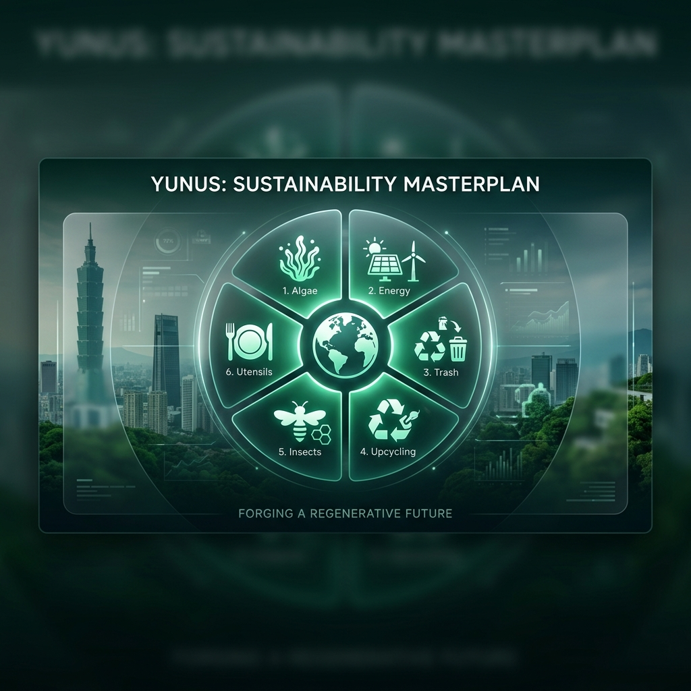

# 🌿 Yunus: Masterplan Keberlanjutan Urban
## Infrastruktur Sirkular Canggih untuk Penghargaan Inovasi Yunus Taiwan ke-6

|  |  |  |
| :---: | :---: | :---: |

> **"Mendefinisikan Ulang DNA Perkotaan Taiwan melalui Kecerdasan Biologis dan Mekanis."**

Selamat datang di **Yunus**, kumpulan strategis perusahaan sosial dan lingkungan yang dikurasi dan direkayasa oleh **Steven Tanardi**. Proyek ini mengintegrasikan prinsip ekonomi sirkular, bioteknologi serangga, dan AI-molekuler ke dalam masterplan terpadu untuk ketahanan perkotaan abad ke-21.

---

## 🏛️ Portofolio Strategis (Dukungan Bahasa Indonesia)

Pilih modul di bawah ini untuk menjelajahi riset mendalam, proposal taktis, dan analisis dampak material.

| Proyek 01 | Proyek 02 | Proyek 03 |
| :---: | :---: | :---: |
| **Lab Produk Upcycled** | **Sistem Ubin Kinetik** | **Pemilahan AI Molekuler** |
|  |  |  |
|  |  |  |
|  |  |  |

 

| Proyek 04 | Proyek 05 | Proyek 06 |
| :---: | :---: | :---: |
| **Bio-Loop BSF** | **Sistem Hidangan Sirkular** | **Dinding Bio-Oksigen** |
|  |  |  |
|  |  |  |
|  |  |  |

 

---

## 🔬 Ikhtisar Inisiatif Utama

### 🍎 1. Transformasi "Buah Buruk Rupa" (Upcycling)
Jaringan logistik yang menyerap buah-buahan yang ditolak secara estetika dari petani Taiwan dan mengubahnya menjadi camilan dehidrasi bernilai tinggi menggunakan teknologi vakum.
- **Tujuan**: Nol limbah makanan & laba bersih petani 25% lebih tinggi.

### ⚡ 2. Pemanenan Energi Kinetik (Skala Grid)
Modul lantai pintar yang dirancang untuk pusat transit dengan lalu lintas tinggi di Taiwan. Mengubah gerakan urban menjadi mikro-grid terbarukan dan dashboard pendidikan publik interaktif.
- **Tujuan**: Mikro-grid energi terbarukan berbasis komunitas.

### 🔎 3. Pemilahan AI Presisi Molekuler
Sistem multimodal (NIR + 4K RGB) yang dibangun untuk mencapai kemurnian 99,5% dalam aliran daur ulang, mengidentifikasi jenis resin pada tingkat kimia.
- **Tujuan**: Siklus polimer sirkular yang sejati.

### 🐛 4. Bio-Loop BSF (Transformasi Serangga)
Konverter limbah organik paling efisien di dunia. Mengalihkan sisa makanan pasar malam menjadi protein larva premium (Pakan ikan) dan frass (Pupuk organik).
- **Tujuan**: Otonomi pakan dari limbah biologis 100%.

### 🍴 5. Hidangan Sirkular (Logistik Pakai Ulang)
Layanan berlangganan B2B untuk restoran guna menghilangkan plastik sekali pakai. Menyediakan sanitasi kelas ISO 22000 dan logistik terbalik yang dilacak RFID.
- **Tujuan**: Pengurangan budaya bungkus makanan plastik sekali pakai.

### 🧪 6. Dinding Bio-Oksigen (Bio-Reaktor)
Bioreaktor vertikal dalam ruangan untuk apartemen kepadatan tinggi di Taipei. Menggunakan alga untuk memproduksi 10x lebih banyak oksigen daripada tanaman hias sambil menyaring PM2.5.
- **Tujuan**: Bio-filtrasi udara urban yang terdesentralisasi.

---

## 🛠️ Sumber Daya Repositori
Untuk data teknis, laporan mentah, dan PDF pendukung, silakan kunjungi folder **[Resources](Resources/)**.

- **[Panduan Proposal](Resources/2_Proposal_Guidance/)** | **[PDF Referensi](Resources/4_Reference_PDFs/)** | **[Suplemen Riset](Resources/1_Research_Analysis/)**

---

### 🎨 Filosofi Desain
Semua proposal dirancang sedemikian rupa agar **memukau secara visual**, **layak secara operasional**, dan **transformatif secara sosial**. Berbasis pada prinsip Bisnis Sosial Yunus.

> [!IMPORTANT]
> Semua kekayaan intelektual, cetak biru, dan proposal di dalam repositori ini adalah milik **Steven Tanardi**.

---
© 2026 Steven Tanardi. Hak Cipta Dilindungi Undang-Undang.
